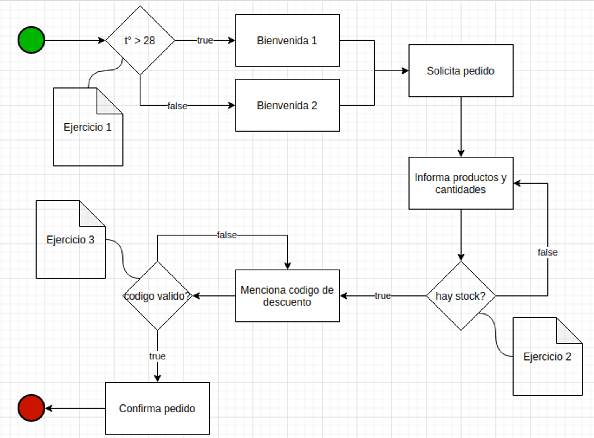

# Python Backend Challenge 

## Nombre: Leandro Carriego
## [LinkedIn](https://www.linkedin.com/in/leandro-carriego/)
## [Portfolio](https://portfolio-leandro-carriego.site/)

## Introducción:

El cliente "Heladerías..." nos solicita la construcción de un bot para la toma de
pedidos. Usted forma parte del equipo asignado a este proyecto y tiene como
responsabilidad el desarrollo de funciones auxiliares que le darán al bot la capacidad
de desenvolverse en la conversación.

### Flujo de diálogo:

El siguiente diagrama ejemplifica el diálogo el bot:



### Enunciado:

Como se puede observar en el diagrama, en determinados momentos, el bot
necesitará realizar validaciones externas para evaluar cómo continuar.
A continuación, se define el alcance de esas funciones y se solicita desarrollar las
mismas.

### Ejercicio 1:

Completar el método is_hot_in_pehuajo con el siguiente objetivo:

- Consultar la información de clima y devolver True si la temperatura actual
supera los 28 grados celsius o False caso contrario. Esto implica incluso
devolver False ante cualquier excepción http.

Información extra:
API Información de clima:

- Link a documentacion: https://openweathermap.org/current#geo

Utilice para comenzar:

```python
import requests

class GeoAPI:
    API_KEY = "d81015613923e3e435231f2740d5610b"
    LAT = "-35.836948753554054"
    LON = "-61.870523905384076"

    @classmethod
    def is_hot_in_pehuajo(cls):
        pass
```

### Ejercicio 2.1:

Dadas las variables: product_name y quantity, complete la función
is_product_available con el siguiente objetivo:

- Buscar en un pandas DataFrame y devolver True si existe stock, False caso
contrario.

Utilice para comenzar:

```python
import pandas as pd

_PRODUCT_DF = pd.DataFrame({"product_name": ["Chocolate",
"Granizado", "Limon", "Dulce de Leche"], "quantity":
[3,10,0,5]})

def is_product_available(product_name, quantity):
    pass
```

### Ejercicio 2.2:

Si miramos el diagrama de flujo al momento de la decisión de stock, encontramos un
potencial loop infinito, ya que el usuario podría continuar ingresando productos
inválidos o sin stock. Reformule la función para solucionar este problema.

__________________________


### Clonar y Ejecutar Proyecto

Sigue los siguientes pasos para clonar y ejecutar este proyecto en tu entorno local.

### Requisitos previos

1. [Python](https://www.python.org/) - Asegúrate de tener Python instalado, que incluye pip para administrar las dependencias del proyecto.

3. [Git](https://git-scm.com/) - Necesitarás Git para clonar el repositorio.

## Pasos para clonar y ejecutar el proyecto

1. **Clonar el repositorio:**
   Abre tu terminal (o línea de comandos) y ejecuta el siguiente comando para clonar el proyecto desde GitHub:

   ```bash data-copyable
    git clone https://github.com/leandrocarriego/python_backend_challenge_inceptia.git

2. **Preparar y activar entorno virtual:**
    
    ```bash data-copyable
   python -m venv venv


3. **Activar entorno virtual:**
    
    ```bash data-copyable
   venv\Scripts\Activate
   
4. **Instalar dependencias:**
    
    ```bash data-copyable
   pip install -r requirements.txt


Dentro de cada archivo estan comentados los ejemplos de uso

